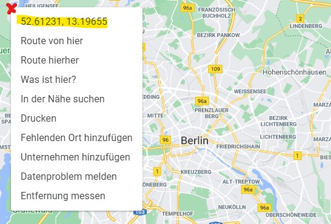

# Google Maps Places Scraper

## Table of Contents
1. [What is it?](#what-is-it?)
2. [How it works](#how-it-works)
3. [How to use](#how-to-use)
4. [Architecture](#architecture)
5. [Potential](#potential)
6. [Limitations](#limitations)


## What is it?
This tool allows you to gather data from all places from the Google Maps API within a range of geographical coordinates. You will be able to access the company's name, address, average rating, geographical location, and much more. This allows you to find new B2B leads more easily or analyze locational data for potential places to let your company grow in it.

## How it works
The Google Maps Places API allows you to look up places within a given radius. For a given rectangle area, this tool creates contiguous search-circles throughout the whole rectangle. As there will be areas in between a square of four circles, which are not included in the search, this tool runs a second iteration of smaller circles in these gaps.

## How to use
### Installation
Install the latest version from this git repository by using pip:
```
$ pip install git+https://github.com/yosefaziz/gmaps-scraper.git
```
### Input
You will have to edit two configuration files:
#### setup_area.xlsx
This file includes 5 input fields:
- **country**: Name of the country you are searching in
- **area_block**: Description of the area you are searching in
- **upper_left_coordinates**: The latitude/longitude coordinates of the upper left border
- **lower_right_coordinates**: The latitude/longitude coordinates of the lower right border
- **search_terms_comma_separated**: List of search terms which are requested in the API

Tip: To get the coordinates more easily, open Google Maps and right-click on the specific border location that you want. 



#### setup.yaml
- **input_file_name**: File name of the setup excel sheet
- **search_radius_km**: Search radius in km (float)
- **credentials_file_path**: Google Cloud Platform Service Account Credentials as JSON 
- **project_id**: ID of the Google Cloud Platform project
- **bucket_name**: Name of the Google Cloud Storage bucket
- **api_key**: Google Maps API Key

### Output
You will get an Excel sheet of your scrapes and it will automatically upload your result file into Google Cloud Storage, which triggers a cloud function that uploads this data into BigQuery.

*In the samples folder you can find examples of the input and output.*

## Architecture

The tool needs to be run on your local device, requests data from the Google Maps API, and save the results as a CSV on your local hard drive. This file will be uploaded into a bucket in Google Cloud Storage. The Cloud Function gets triggered by every file finalization (= creation) within this bucket. It inserts the values from the CSV into BigQuery and makes it available for further analytics.

## Potential
The Google Maps API also provides getting more information like phone numbers, email addresses, websites, which opens a potential from a B2B sales perspective to gain leads.

Another possibility is geographical analytics e.g. to calculate good places where to open a new restaurant within a highly visited area with very few restaurants.

## Limitations
Currently, you can find specific problems in the code within the GitHub Issues. As the Google Maps API changes consistently, this code could outdate at any time. 
The current architecture is very slow, which could be sped up by multithreading. Also, there is the risk that the code fails within the scraping, which could cost a lot of money. For that, the architecture needs to be changed by instantly uploading the API results into BigQuery. 
There will be a lot of duplicates as the Google Maps API also returns some results outside of the radius. This leads to higher cost, but is a conscious decision to get sure to have a 100% result. To reduce cost in risk of losing some places, you can exclude the second run within the code.
